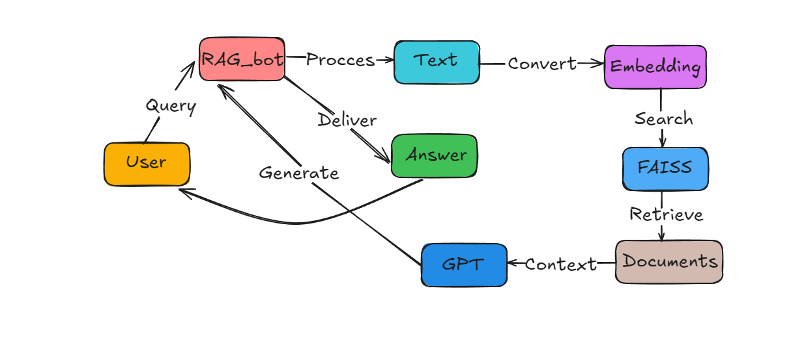

# Article Assistant (RAG Telegram Bot) 


**Live Bot**: [@RAG_Engineering_bot](https://t.me/RAG_Engineering_bot)

**My contact**: [@Konstantin_vanov](https://t.me/Konstantin_vanov)

Telegram bot for Q&A about articles using Retrieval-Augmented Generation. Indexes web content and provides accurate answers with sources.


## 🌟 Features 
- **Smart Indexing** - Processes articles from any URL or uploaded PDFs

- **Multilingual Support** - Handles English/Russian content and questions

- **Document Summarization** - New "Summary" feature extracts key points

- **Custom Prompts** - Control response style and format

- **Proxy Support** - Works with OpenAI API in restricted regions

- **Source Citing** - Always shows evidence for answers


## ⚠️ Demo Version Limitations
- **Maximum 3 user requests per day**

- **After the limit, you'll need your own API key**

## 🚀 Quick Start
### Prerequisites
- Python 3.9+

- [Telegram Bot Token](https://core.telegram.org/bots#how-do-i-create-a-bot)

- [OpenAI API Key](https://platform.openai.com/api-keys)

### RAG System Workflow
 


### Installation
``` bash
git clone https://github.com/Konstantin-vanov-hub/RAG_bot.git
cd RAG_bot
python -m venv venv
source venv/bin/activate  # Linux/Mac
venv\Scripts\activate     # Windows
pip install -r requirements.txt
Configuration
Create .env file:

bash
cp .env.example .env
Add your credentials:

ini
TELEGRAM_TOKEN=your_bot_token
OPENAI_API_KEY=your_openai_key
# Optional for Russia:
PROXY_API_URL=https://proxyapi.ru/
Launch
bash
python bot.py

🎮 Usage Guide
Basic Flow
Start bot with /start

Add article via "Enter article" button (URL or PDF)

Ask questions using "Ask question" option

Get summaries with "Summary" button

New Summary Feature
The bot can now generate concise 3-5 point summaries of indexed content:

Extracts key arguments and findings

Highlights practical applications

Presents information in bullet-point format

Works in both English and Russian

Command Reference
Action	Command	Description
Start	/start	Initialize bot
Add Content	"Enter article"	Index new content (URL/PDF)
Ask Question	"Ask question"	Get answers about content
Get Summary	"Summary"	Generate document summary
Change Language	"Change language"	Switch EN/RU
Prompt Settings	"Prompt settings"	Customize response style
⚙️ Technical Details
Architecture
The bot follows a RAG (Retrieval-Augmented Generation) architecture:

Content is indexed and split into chunks

Chunks are converted to embeddings using OpenAI

Questions are matched against stored embeddings

Relevant context is fed to GPT-4 for answer generation

Tech Stack
Core: Python 3.9, LangChain 0.3+

Vector DB: FAISS

Embeddings: OpenAI text-embedding-3-small

LLM: GPT-4

Parsing: BeautifulSoup4

Cache: Local FAISS index storage

🛠 Troubleshooting
Issue	Solution
API Key Error	Verify .env file exists
Empty Responses	Check article URL validity
Slow Indexing	Reduce chunk_size in indexer.py
Proxy Errors	Test API endpoint with curl
Encoding Issues	Set LANG=C.UTF-8 in environment
📜 License
MIT License © 2025 Konstantin

🤝 Contributing
Fork the repository

Create feature branch (git checkout -b feature/improvement)

Commit changes (git commit -am 'Add new feature')

Push to branch (git push origin feature/improvement)

Open Pull Request

📬 Support
For assistance, please open an issue or contact @Konstantin_vanov